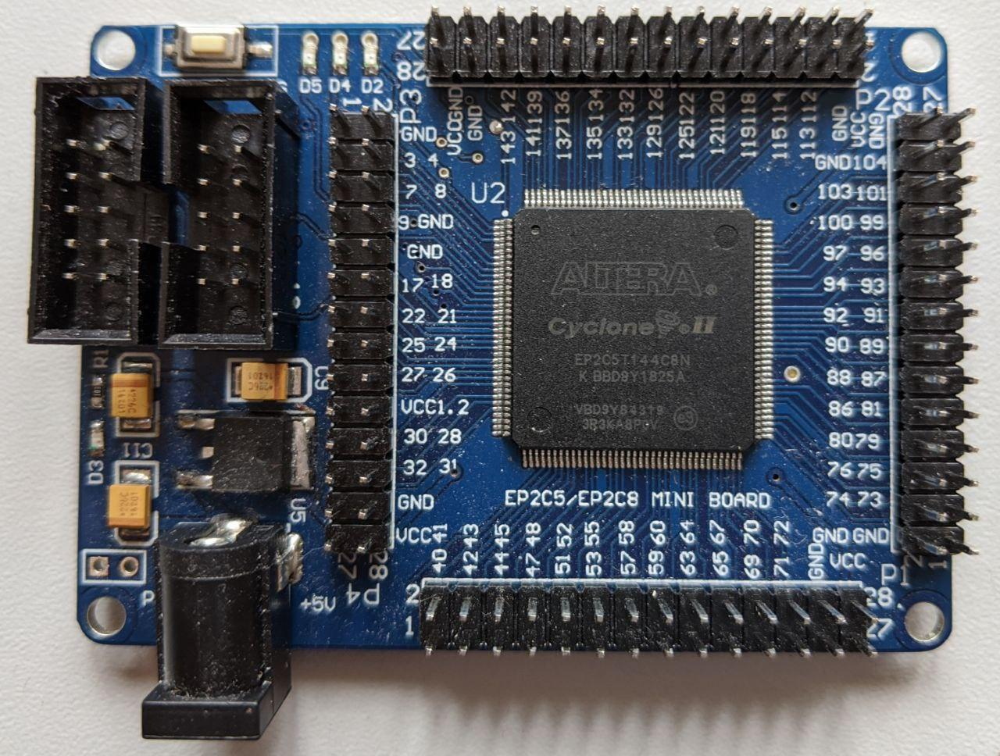

# EP2C5T144 Development Board Tutorial

Das EP2C5T144 Development Board ist für unter 20€ unter anderem bei eBay und Amazon erhältlich. Leider ist der Einstieg in die Programmierung dieses Boards mit VHDL nicht ganz einfach. Diese Seite listet Ressourcen auf, die mir beim Einstieg geholfen haben.

- [land-boards.com](http://land-boards.com/blwiki/index.php?title=Cyclone_II_EP2C5_Mini_Dev_Board): Wiki mit ein paar allgemeinen Daten.
- [youtube.com](https://www.youtube.com/watch?v=le6Jo5DpLao): Einstiegsvideo in die Programmierung. Achtung: Enthält Fehler. Es ist hilfreich die Kommentare zu lesen!
- 
  [openimpulse.com](https://www.openimpulse.com/blog/products-page/product-category/ep2c5t144-altera-cyclone-ii-fpga-development-board/),
  [leonheller.com](http://www.leonheller.com/FPGA/EP2C5T144mini.pdf): Download des Schaltplans

## Schaltplan und Pins

Eigentlich ist der Schaltplan recht selbsterklärend. Fast alle Pins sind auf die vier langen Pinheader rausgeführt. Allerdings gibt es folgende Besonderheiten:

### Besondere Pins

- `PIN144` ist über den Taster mit `GND` verbunden (falls der Taster benutzt werden soll, muss ein Pull-Up-Widerstand einprogrammiert werden).
- `PIN17` ist mit dem `50mHz`-Oszillator verbunden.
- `PIN3`, `PIN7`, `PIN9` sind jeweils über eine LED mit `VCC3.3` verbunden.

### Nicht nutzbare Pins

- `PIN26` ist über `R1`  (0Ω) fest mit `VCC1.2` verbunden.
- `PIN27` ist über `R2`  (0Ω) fest mit `GND`    verbunden.
- `PIN80` ist über `R9`  (0Ω) fest mit `GND`    verbunden.
- `PIN81` ist über `R10` (0Ω) fest mit `VCC1.2` verbunden.
- `PIN73` ist über `R13` (10kΩ) mit `VCC3.3` und über `C14` (10µF) mit `GND` verbunden.

Diese Pins können daher nicht als I/O Pins benutzt werden. Man kann die 0Ω-Widerstände mit etwas Geschick aber entfernen. Laut [land-boards.com](http://land-boards.com/blwiki/index.php?title=Cyclone_II_EP2C5_Mini_Dev_Board) sind diese Pins so komisch angeschlossen, um auch mit einem anderen FPGA, dem `EPC28`, kompatibel zu sein.

## Programmierung

Die Programmierung erfolgt mit der kostenlosen Quartus II Software. Allerdings unterstützten aktuelle Versionen den genutzten FPGA nicht mehr. **Die letzte Version, die den FPGA unterstützut, ist *Quartus 13.0SP1* **. Die Software kann hier heruntergeladen werden: https://fpgasoftware.intel.com/13.0sp1/?edition=subscription&platform=windows

### Setup 

1. Klick auf "Create a New Project"
   
2. Klick auf "Next"
   
3. Namen und Speicherort für das Projekt vergeben, danach Klick auf "Next"
   
4. Klick auf "Next"
   
5. FPGA auswählen, danach Klick auf "Next"
   
6. Klick auf "Next"
   
7. Klick auf "Next"
   
8. Das erstellte Projekt wird geöffnet.
   

Als nächstes sollte noch eine wichtige Option geändert werden. 
Standardmäßig werden alle nicht benutzten Pins nämlich mit `GND` verbunden.
Das führt aber zu einem Kurzschluss, da wie oben beschrieben einige Pins ja mit `VCC` verbunden sind.
Daher sollte man in den "Device"-Einstellungen einstellen, dass alle unbenutzten Pins als "input tri-stated" programmiert werden:

1. Rechtsklick auf das Projekt, dann auf "Device..."
   
2. Klick auf "Device and Pin Options..."
   
3. Klick auf "Unused Pins" und dann Auswahl von "As input tri-stated"
    

Desweiteren kann man in den Einstellungen noch den VHDL-Standard auf "VHDL 2008" stellen, um modernere VHDL-Features nutzen zu können:

1. Rechtsklick auf das Projekt, dann auf "Properties..."
   
2. Auswahl von "VHDL 2008"
   