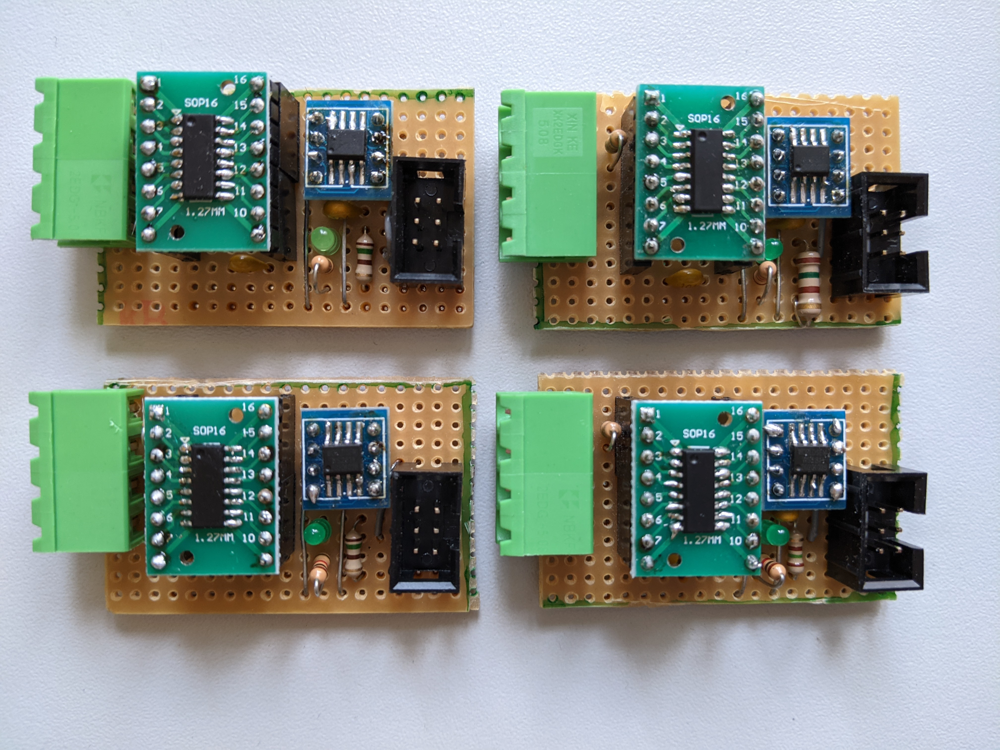
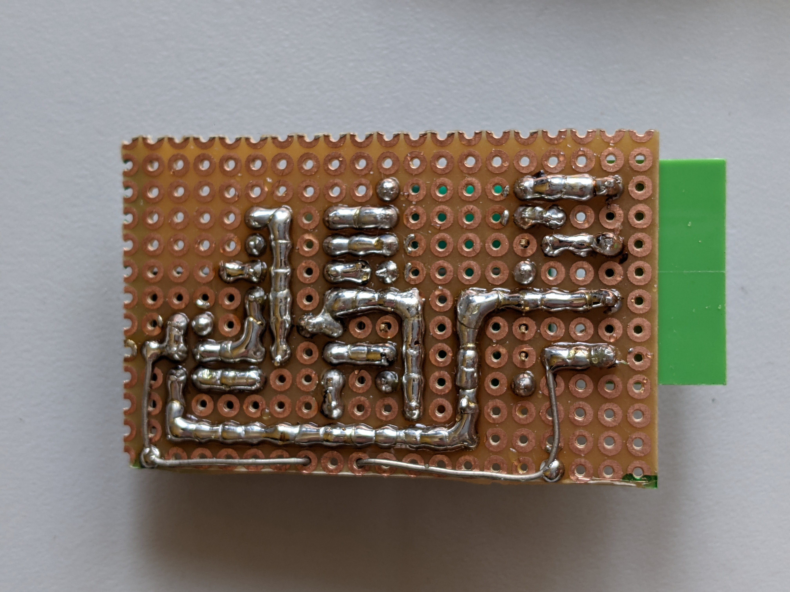

# MobaLedLib PFS173 Bipolar LED Driver

| Oberseite                   | Unterseite                       |
| --------------------------- | -------------------------------- |
| |  |

Bei diesem Projekt handelt es sich um einen Treiber-Baustein für bipolare LEDs, wie sie z.B. in den Märklin Hobby-Signalen verwendet werden.
Wir benutzen einen sehr kostengünstigen [PFS173](https://free-pdk.github.io/chips/PFS173) Mikrocontroller um das PWM-Signal des roten und grünen Kanals eines WS2811 zu lesen.
Basierend auf diesem Signal generiert der Mikrocontroller an zwei Pins ein komplementäres PWM-Signal.
An diese beiden Ausgänge kann dann eine bipolare LED angeschlossen werden.

Die vier Ausgänge auf der linken Seite des Moduls sind wiefolgt belegt:

| Ausgang   | Funktion                                                      |
| --------- | ------------------------------------------------------------- |
| 1 (oben)  | rote LED +, grüne LED - (bis 20mA, keine Konstantstromquelle) |
| 2         | rote LED -, grüne LED + (bis 20mA, keine Konstantstromquelle) |
| 3         | 5V                                                            |
| 4 (unten) | blauer Kanal (unverändert, direkt vom WS2811)                 |

Auf dem Board befindet sich eine Heartbeat-LED, die fortwährend blinkt.




## Programmierung

Der Mikrocontroller ist mit der [Free-PDK Toolchain](https://free-pdk.github.io/) programmiert.
Zusätzlich benötigt werden die Include-Files von [hier](https://github.com/free-pdk/pdk-includes) und [hier](https://github.com/free-pdk/easy-pdk-includes).

## Lizenz

GPLv2, wobei die Dateien im "code/includes" Ordner von [hier](https://github.com/free-pdk/free-pdk-examples/tree/master/include) stammen.